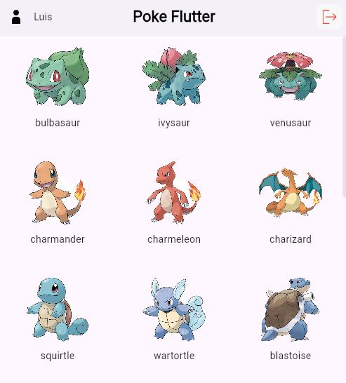

<a name="readme-top"></a>

[![MIT License][license-shield]][license-url]
[![LinkedIn][linkedin-shield]][linkedin-url]


<!-- PROJECT LOGO -->
<br />
<div align="center">
  

 

---
  <h3 align="center">Poke Flutter</h3>

  <p align="center">
    Simple Flutter test project using PokeAPI
    <br />
    <br />
    <a href="https://github.com/joao-paulo-santos/Poke-Flutter/issues">Report Bug</a>
    ·
    <a href="https://github.com/joao-paulo-santos/Poke-Flutter/issues">Request Feature</a>
  </p>
</div>

<div align="center">
    <p float="left" >
    
    
    </p>
</div>


<!-- ABOUT THE PROJECT -->
## About The Project

This is a small assignment that was requested as a proof of skill.<br>
The project consists of an small Flutter application that has an authentication screen and consumes information from a public API, in this case PokeAPI.

Requirements:
- Latest Stable Flutter Version
- Bloc for state managment
- Separation of concerns (Core / UI Packages)
- Authentication Screen (login info can be mocked)
- Go_router Navigation
- Dio for http Requests
- Dashboard to display Consumed API data

</br>

---

<p align="right">(<a href="#readme-top">back to top</a>)</p>


### Built With

[![Flutter][Flutter]][Flutter-url]
[![Dart][Dart]][Dart-url]
<p align="right">(<a href="#readme-top">back to top</a>)</p>


<!-- GETTING STARTED -->
## Getting Started

### Prerequisites

- Visual Studio installed
- Flutter plugin installed and setup

### Installation

 - Clone the repo
```sh
git clone https://github.com/joao-paulo-santos/poke-flutter.git
```


<p align="right">(<a href="#readme-top">back to top</a>)</p>


<!-- USAGE EXAMPLES -->
## Usage

 - Starting the program: 
```sh
# Inside Visual Studio code or with the terminal inside the project directory:
flutter pub get
# Then run the application using VS Code with your prefered device
# Most of the testing was done using Chrome but it's confirmed running on Android
```

<p align="right">(<a href="#readme-top">back to top</a>)</p>


## Technical Documentation

### Architecture

At first glance i would have picked the clean architecture with domain driven desing model due to my .Net background, this would mean Separating the project in the following packages:

- Core
- Services
- Infrastructure (Data)
- Presentation

Or an approach more flutter specifc, mixing clean architecure with feature specific segregation, but I followed the assignment recomended architecture of separating the packages as follows:

- Core
- Presentation

This kind of architecture if very beneficial due to the separation of concerns, improving maintainability, reusability and testability.

#### Project Structure

<div align="center">

</div>

---

### Authentication

The application had been hard coded (AuthService) to only accept the following credentials:

        Username: Luis
        Password: 123

#### Error Handling

Using Bloc state managment we emit error states on error that are then catched in the presentation layer by listeners, on both cases (Auth / Pokemon page), an Alert box is shown with the error.

Using the same principle, loading states are implemented as well.

<p align="right">(<a href="#readme-top">back to top</a>)</p>

### Testing

the following tests where implemented using mocktail to mock Dio responses:

- Fetches pokemons and emits correct states
- Pokemon imageUrl should generate the correct URL
- parsePokemons should parse pokemon data correctly

---

<p align="right">(<a href="#readme-top">back to top</a>)</p>

### Packages Used
```yaml
    go_router: ^14.6.0
    flutter_bloc: ^8.1.6
    flutter_svg: ^2.0.14
    dio: ^5.7.0
    cached_network_image: ^3.4.1
```


<!-- LICENSE -->
## License

Distributed under the Apache-2 License. See `LICENSE` for more information.

<p align="right">(<a href="#readme-top">back to top</a>)</p>


<!-- CONTACT -->
## Contact

João Santos - [Linkedin](https://www.linkedin.com/in/jo%C3%A3o-santos-015a082b9/)

Project Link: [https://github.com/joao-paulo-santos/poke-flutter](https://github.com/joao-paulo-santos/poke-flutter)

<p align="right">(<a href="#readme-top">back to top</a>)</p>


[license-shield]: https://img.shields.io/pypi/l/giteo?style=for-the-badge
[license-url]: https://github.com/joao-paulo-santos/PyFolderSync/blob/master/LICENSE
[linkedin-shield]: https://img.shields.io/badge/-LinkedIn-black.svg?style=for-the-badge&logo=linkedin&colorB=555
[linkedin-url]: https://www.linkedin.com/in/jo%C3%A3o-santos-015a082b9/
[Flutter]: https://img.shields.io/badge/Flutter-02569B?logo=flutter&logoColor=fff
[Flutter-url]: https://flutter.dev/
[Dart]: https://img.shields.io/badge/Dart-%230175C2.svg?logo=dart&logoColor=white
[Dart-url]: https://dart.dev/

